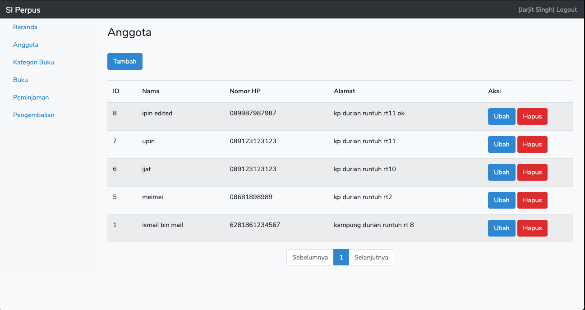

# DEMO SI Perpus (Simple)
Demo simpel membuat sistem perpus dengan Laravel dan VueJS

## Kebutuhan
- PHP 7.3
- MySQL
- Composer
- NodeJS LTS

## Cara Mennjalankan di Lokal
- clone menggunakan git dan masuk ke direktori proyek

```bash
git clone git@github.com:andhikayuana/demo-si-perpus.git
cd demo-si-perpus
```

- jalankan perintah berikut untuk instalasi dependensi php

```bash
composer install
```

- jalankan perintah berikut untuk instalasi dependensi nodejs

```bash
npm install
```

- jangan lupa buat database dan ubah konfigurasi dengan membuat file `.env` dari `.env.example`

```bash
cp .env.example .env
```

```.env
APP_NAME="SI Perpus"
APP_TIMEZONE=Asia/Jakarta

DB_CONNECTION=mysql
DB_HOST=127.0.0.1
DB_PORT=3306
DB_DATABASE={{database_anda}}
DB_USERNAME={{user_dari_database_anda}}
DB_PASSWORD={{password_dari_database_anda}}

BASE_URL_API=http://localhost:8000/api/v1/

```

- jalankan migrasi database dengan perintah

```bash
php artisan migrate
```

- buat akun petugas dengan tinker

```bash
Psy Shell v0.10.4 (PHP 7.3.19 — cli) by Justin Hileman
>>> \App\User::create(['name' => 'Jarjit Singh', 'email' => 'jarjit@spam4.me', 'password' => \Hash::make('jarjit123!@#')])
=> App\User {#4081
     name: "Jarjit Singh",
     email: "jarjit@spam4.me",
     updated_at: "2020-09-26 09:10:13",
     created_at: "2020-09-26 09:10:13",
     id: 1,
   }
>>> 
```

- compile assets dengan perintah berikut (development)

```bash
npm run watch
```

- jalankan server Laravel dengan perintah berikut

```bash
php artisan serve
```

- sekarang anda bisa akes dengan browser, http://localhost:8000

## Screenshot

